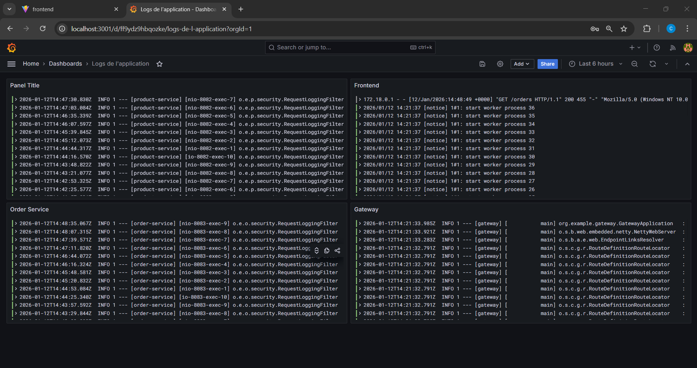
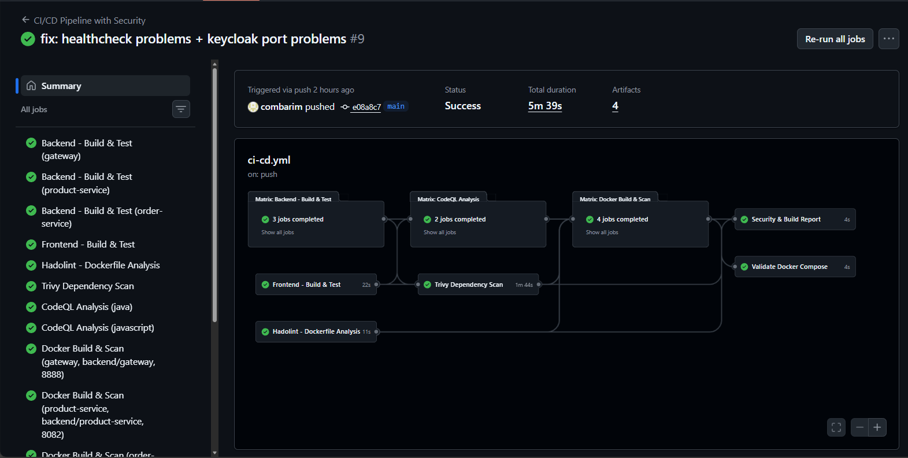
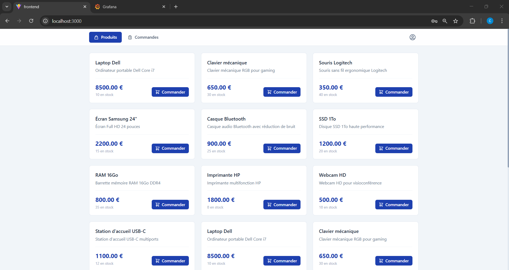
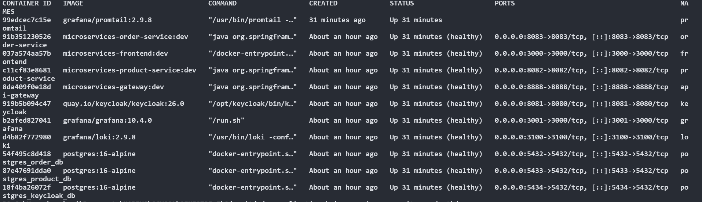

# Microservices Security Project

Ce projet est une application basee sur une architecture microservices, concue avec une approche DevSecOps, mettant l'accent sur la securite, l'observabilite et une experience utilisateur moderne.

---

## Table des matieres

1. [Apercu](#apercu)
2. [Architecture Globale](#architecture-globale)
   - [Diagramme d'architecture](#diagramme-darchitecture)
   - [Flux d'authentification](#flux-dauthentification)
   - [Communication entre services](#communication-entre-services)
3. [Composants du Projet](#composants-du-projet)
   - [Backend (Java/Spring Boot)](#1-backend)
   - [Frontend (React/TypeScript)](#2-frontend)
   - [DevSecOps](#3-devsecops)
4. [Stack Technique](#stack-technique)
5. [Demarrage Rapide](#demarrage-rapide)
6. [Environnements](#environnements)
7. [Pipeline CI/CD](#pipeline-cicd)
8. [Monitoring et Logging](#monitoring-et-logging)

---

## Apercu

| Tableau de bord Grafana | Workflow CI/CD | Page des produits |
| :---: | :---: | :---: |
|  |  |  |

---

## Architecture Globale

Le projet se compose de plusieurs couches interconnectees :

- **Couche Client** : Application React communiquant avec l'API Gateway
- **Couche Gateway** : Point d'entree unique gerant le routage et la validation JWT
- **Couche Services** : Microservices metier (Product et Order)
- **Couche Donnees** : Bases de donnees PostgreSQL dediees par service
- **Couche Securite** : Keycloak pour l'authentification OAuth2/OIDC
- **Couche Monitoring** : Stack Loki/Grafana/Promtail pour l'observabilite

### Diagramme d'architecture

```
+---------------------------------------------------------------------------+
|                              COUCHE CLIENT                                |
|                                                                           |
|   +---------------------------------------------------------------+       |
|   |              React Frontend (Port 3000)                       |       |
|   |     React 19 + TypeScript + Vite + Tailwind CSS + Keycloak-JS |       |
|   +-----------------------------+---------------------------------+       |
+---------------------------------|-----------------------------------------+
                                  | HTTP (Axios)
                                  v
+---------------------------------------------------------------------------+
|                          API GATEWAY (Port 8888)                          |
|                   Spring Cloud Gateway + JWT Validation                   |
|                                                                           |
|   Routes:  /products/** --> Product Service                               |
|            /orders/**   --> Order Service                                 |
+--------------+----------------------------------------------+-------------+
               |                                              |
               v                                              v
+------------------------------+          +------------------------------+
|      Product Service         |          |        Order Service         |
|        (Port 8082)           |<-------->|        (Port 8083)           |
|      Spring Boot + JPA       | WebClient|      Spring Boot + JPA       |
|   OAuth2 Resource Server     |          |   OAuth2 Resource Server     |
+--------------+---------------+          +--------------+---------------+
               | JDBC                                    | JDBC
               v                                         v
+------------------------------+          +------------------------------+
|         PostgreSQL           |          |         PostgreSQL           |
|   product_db (Port 5433)     |          |    order_db (Port 5432)      |
+------------------------------+          +------------------------------+


===========================================================================
                       SECURITE ET AUTHENTIFICATION
===========================================================================

                +--------------------------------------+
                |        Keycloak (Port 8081)          |
                |    Identity & Access Management      |
                |    Realm: microservices-realm        |
                |    Roles: ADMIN, CLIENT              |
                |                 |                    |
                |                 v                    |
                |    PostgreSQL keycloak_db (5434)     |
                +--------------------------------------+
                                  ^
                                  | JWT Token Validation
                                  |
          +-----------------------+-----------------------+
          |                       |                       |
     [Frontend]              [Gateway]              [Services]


===========================================================================
                         MONITORING ET LOGGING
===========================================================================

+-----------+          +-----------+          +---------------------+
| Promtail  |--------->|   Loki    |--------->|   Grafana (3001)    |
| (Agent)   |          |(Port 3100)|          |     Dashboards      |
+-----------+          +-----------+          +---------------------+
      ^
      | Docker Logs
      |
[Tous les conteneurs]


===========================================================================
                            PIPELINE CI/CD
===========================================================================

GitHub Actions:
+------------+     +------------+     +------------+     +------------+
|   Build    |---->|  Security  |---->|   Docker   |---->|   Deploy   |
|   & Test   |     |  Scanning  |     |   Build    |     | Validation |
+------------+     +------------+     +------------+     +------------+
                         |
          +--------------+--------------+
          v              v              v
      [Trivy]       [CodeQL]      [Hadolint]
```

### Flux d'authentification

1. L'utilisateur accede au frontend et est redirige vers Keycloak pour l'authentification
2. Keycloak valide les identifiants et emet un JWT Token
3. Le frontend stocke le token et l'envoie avec chaque requete a l'API Gateway
4. L'API Gateway valide le JWT et extrait les roles de l'utilisateur
5. La requete est routee vers le microservice approprie
6. Chaque microservice valide egalement le token (defense en profondeur)

### Communication entre services

| Source | Destination | Protocole | Description |
|--------|-------------|-----------|-------------|
| Frontend | API Gateway | HTTP/HTTPS | Requetes API via Axios |
| API Gateway | Product Service | HTTP | Routage des requetes /products/** |
| API Gateway | Order Service | HTTP | Routage des requetes /orders/** |
| Order Service | Product Service | HTTP (WebClient) | Verification des produits lors des commandes |
| Tous les services | Keycloak | HTTP | Validation des tokens JWT |
| Tous les conteneurs | Loki | HTTP | Envoi des logs via Promtail |

---

## Composants du Projet

### 1. Backend

Le backend est developpe en Java avec Spring Boot et est structure en plusieurs microservices :

| Service | Port | Description | Base de donnees |
|---------|------|-------------|-----------------|
| Gateway | 8888 | Point d'entree unique, routage et securite perimetrique | - |
| Product Service | 8082 | Gestion des operations liees aux produits | PostgreSQL (5433) |
| Order Service | 8083 | Gestion des operations liees aux commandes | PostgreSQL (5432) |

Chaque microservice est securise par Spring Security et utilise des tokens JWT pour l'authentification et l'autorisation. La persistance des donnees est geree par Spring Data JPA avec une base de donnees PostgreSQL dediee par service.

Pour plus de details, consultez le [README du Backend](backend/README.md).

### 2. Frontend

Le frontend est une application web construite avec React et TypeScript, utilisant Vite pour le bundling et Tailwind CSS pour le stylisme.

| Fonctionnalite | Description |
|----------------|-------------|
| Interface Utilisateur | Navigation intuitive (produits, commandes, profil) |
| Authentification | Integration Keycloak via keycloak-js |
| Communication API | Axios pour les requetes HTTP |
| Controle d'acces | Routes protegees selon les roles (ADMIN, CLIENT) |

Pour plus de details, consultez le [README du Frontend](frontend/README.md).

### 3. DevSecOps

Le repertoire `devsecops` contient tous les outils et configurations necessaires :

| Composant | Outil | Description |
|-----------|-------|-------------|
| Containerisation | Docker / Docker Compose | Orchestration des services |
| IAM | Keycloak | SSO, gestion utilisateurs et roles |
| Agregation de logs | Loki | Stockage centralise des logs |
| Visualisation | Grafana | Tableaux de bord et metriques |
| Collecte de logs | Promtail | Agent de shipping des logs |

Pour plus de details, consultez le [README de DevSecOps](devsecops/README.md).

---

## Stack Technique

### Backend

| Technologie | Version |
|-------------|---------|
| Java | 21 |
| Spring Boot | 3.5.9 |
| Spring Cloud | 2025.0.1 |
| Spring Security | OAuth2 Resource Server |
| Spring Data JPA | - |
| PostgreSQL | 16 (Alpine) |
| Maven | Wrapper inclus |

### Frontend

| Technologie | Version |
|-------------|---------|
| React | 19.2.0 |
| TypeScript | 5.9.3 |
| Vite | 7.2.4 |
| Tailwind CSS | 3.4.19 |
| Axios | 1.13.2 |
| React Router DOM | 7.12.0 |
| Keycloak JS | 26.2.2 |

### Infrastructure

| Composant | Version | Port |
|-----------|---------|------|
| Keycloak | 26.0 | 8081 |
| Grafana | 10.4.0 | 3001 |
| Loki | 2.9.8 | 3100 |
| Promtail | 2.9.8 | - |
| PostgreSQL | 16 Alpine | 5432-5434 |

---

## Demarrage Rapide

### Prerequis

- Docker et Docker Compose installes
- Git
- (Optionnel) Java 21 et Node.js 20 pour le developpement local

### Installation

1. **Cloner le depot** :
   ```bash
   git clone https://github.com/votre-utilisateur/microservices-security-project.git
   cd microservices-security-project
   ```

2. **Lancer l'infrastructure DevSecOps** :
   ```bash
   cd devsecops
   docker-compose -f docker-compose.dev.yml up --build -d
   ```

   Une fois les conteneurs demarres, vous devriez voir un resultat similaire a celui-ci avec `docker ps` :

   

3. **Lancer le Backend** (developpement local) :
   ```bash
   # Gateway
   cd backend/gateway
   ./mvnw spring-boot:run

   # Product Service (nouveau terminal)
   cd backend/product-service
   ./mvnw spring-boot:run

   # Order Service (nouveau terminal)
   cd backend/order-service
   ./mvnw spring-boot:run
   ```

4. **Lancer le Frontend** :
   ```bash
   cd frontend
   npm install
   npm run dev
   ```

### URLs d'acces

| Service | URL |
|---------|-----|
| Frontend | http://localhost:3000 |
| API Gateway | http://localhost:8888 |
| Keycloak | http://localhost:8081 |
| Grafana | http://localhost:3001 |

---

## Environnements

| Environnement | Fichier de configuration | Description |
|---------------|--------------------------|-------------|
| Developpement | docker-compose.dev.yml | Services construits localement, hot-reload |
| Production | docker-compose.yml | Images Docker Hub, configurations optimisees |

---

## Pipeline CI/CD

Le pipeline GitHub Actions (`.github/workflows/ci-cd.yml`) execute les etapes suivantes :

### Etapes du pipeline

| Etape | Description | Outils |
|-------|-------------|--------|
| Build & Test | Compilation et tests unitaires | Maven, npm |
| Security Scanning | Analyse des vulnerabilites | Trivy, CodeQL, Hadolint |
| Docker Build | Construction des images Docker | Docker |
| Deploy Validation | Validation de la configuration | Docker Compose |

### Outils de securite

| Outil | Fonction |
|-------|----------|
| Trivy | Scan des dependances (Maven, npm) et images Docker |
| CodeQL | Analyse statique du code (Java, JavaScript) |
| Hadolint | Validation des Dockerfiles |

### Declencheurs

- Push sur les branches `main` ou `develop`
- Pull requests vers `main`

---

## Monitoring et Logging

### Architecture de monitoring

```
[Services] --> [Promtail] --> [Loki] --> [Grafana]
```

### Dashboards Grafana disponibles

- Frontend metrics
- Backend (Gateway)
- Product Service
- Order Service

### Acces

- **Grafana** : http://localhost:3001
- **Loki** : http://localhost:3100 (API)

---

## Structure du projet

```
microservices-security-project/
|-- .github/
|   +-- workflows/
|       +-- ci-cd.yml              # Pipeline CI/CD
|-- backend/
|   |-- gateway/                   # API Gateway
|   |-- product-service/           # Service Produits
|   +-- order-service/             # Service Commandes
|-- frontend/                      # Application React
|-- devsecops/
|   |-- docker-compose.yml         # Configuration production
|   |-- docker-compose.dev.yml     # Configuration developpement
|   |-- keycloak/                  # Configuration Keycloak
|   +-- monitoring/                # Grafana, Loki, Promtail
|-- docs/                          # Documentation et captures d'ecran
+-- README.md                      # Ce fichier
```

---

## Licence

Ce projet est developpe dans le cadre du cours de Securite des Applications.
