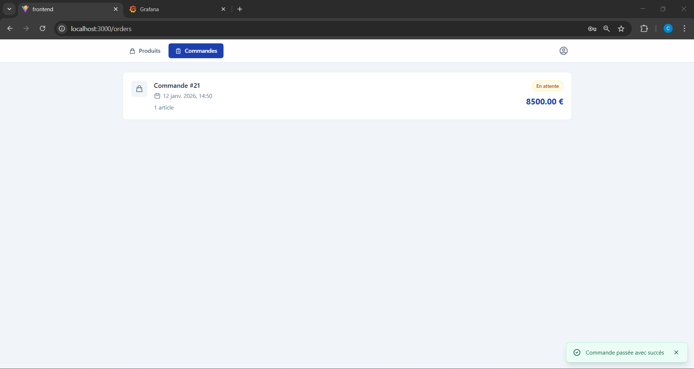
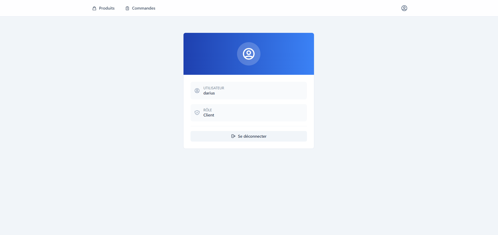
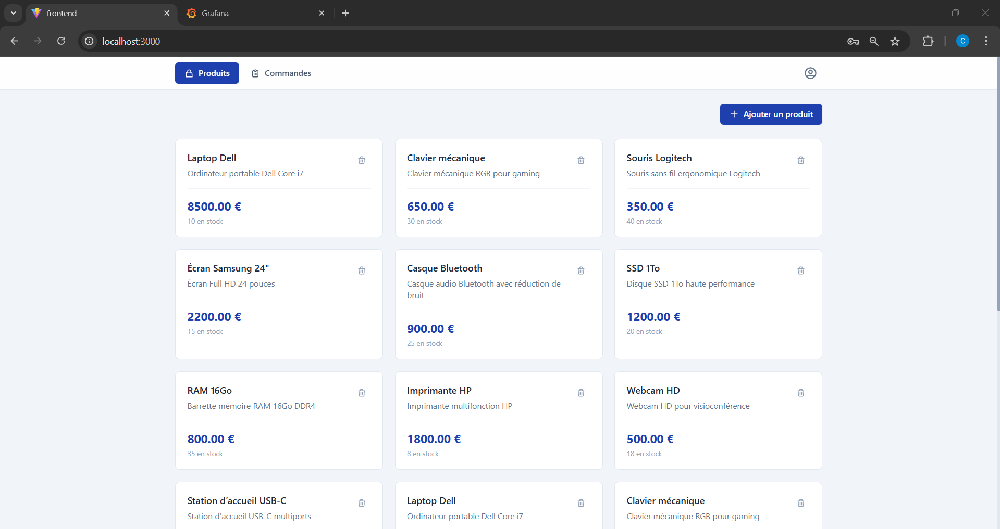
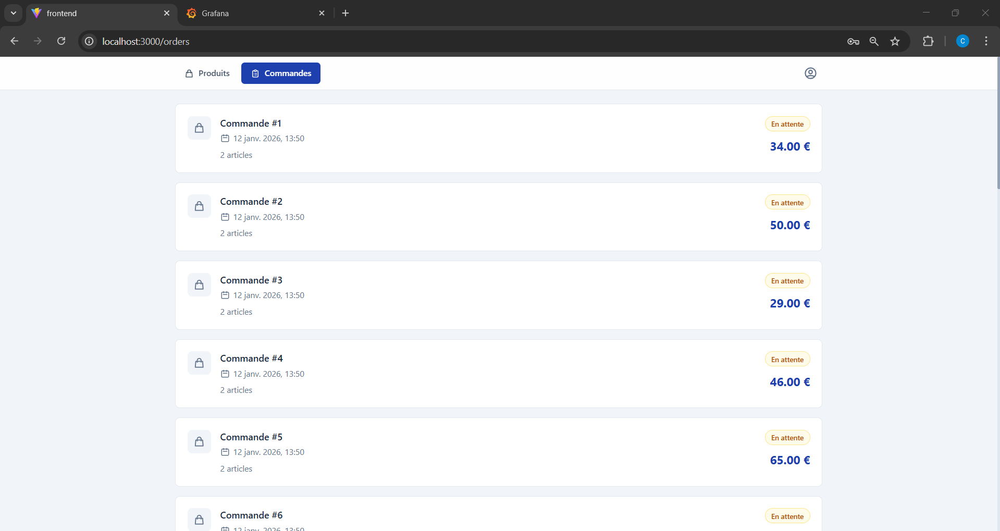

# Frontend

Ce répertoire contient l'application web frontend du projet, construite avec React et TypeScript.

## Technologies Utilisées

- **Framework JavaScript**: React
- **Langage**: TypeScript
- **Bundler**: Vite
- **Gestionnaire de packages**: npm
- **CSS Framework**: Tailwind CSS
- **Requêtes HTTP**: Axios
- **Authentification**: Keycloak JavaScript adapter (`keycloak-js`)
- **Routing**: React Router DOM

## Fonctionnalités

L'application frontend offre les fonctionnalités suivantes :

- **Authentification et Autorisation**: Intégration avec Keycloak pour la gestion des utilisateurs, la connexion (login), l'enregistrement (registration) et l'accès sécurisé aux ressources.
- **Pages Protégées**: Accès conditionnel aux pages (`/products`, `/orders`, `/profile`) basé sur les rôles et les permissions de l'utilisateur.
- **Gestion des produits**: Affichage et potentiellement la gestion des produits via le `product-service` du backend.
- **Gestion des commandes**: Affichage et potentiellement la gestion des commandes via le `order-service` du backend.
- **Interface Utilisateur Réactive**: Une interface moderne et réactive, stylisée avec Tailwind CSS.
- **Notifications**: Système de notifications (toasts) pour informer l'utilisateur des actions réussies ou des erreurs.

## Captures d'écran

### Page des Produits (Vue Client)


### Page des Commandes (Vue Client)


### Page de Profil


### Page de Gestion des Produits (Vue Administrateur)


### Page de Gestion des Commandes (Vue Administrateur)



## Structure du Projet

```
frontend/
├── public/                  # Fichiers statiques (ex: vite.svg)
├── src/
│   ├── assets/              # Assets (ex: images, icônes)
│   ├── components/          # Composants React réutilisables
│   │   ├── Button.tsx
│   │   ├── Card.tsx
│   │   ├── Header.tsx
│   │   ├── Loader.tsx
│   │   ├── Modal.tsx
│   │   ├── ProtectedRoute.tsx
│   │   └── Toast.tsx
│   ├── context/             # Contextes React (ex: AuthContext, ToastContext)
│   │   ├── AuthContext.tsx
│   │   └── ToastContext.tsx
│   ├── pages/               # Pages principales de l'application
│   │   ├── NotFound.tsx
│   │   ├── Orders.tsx
│   │   ├── Products.tsx
│   │   └── Profile.tsx
│   ├── services/            # Logique d'appel aux APIs backend
│   │   └── api.ts
│   ├── App.tsx              # Composant racine de l'application
│   ├── index.css            # Styles globaux (Tailwind CSS)
│   ├── keycloak.ts          # Configuration du client Keycloak
│   ├── main.tsx             # Point d'entrée de l'application React
│   └── types.ts             # Définitions de types TypeScript
├── .dockerignore            # Fichiers à ignorer lors de la construction de l'image Docker
├── Dockerfile               # Dockerfile pour containeriser l'application
├── eslint.config.js         # Configuration ESLint
├── index.html               # Fichier HTML principal
├── nginx.conf               # Configuration Nginx pour servir l'application
├── package.json             # Dépendances et scripts du projet
├── postcss.config.js        # Configuration PostCSS
├── tailwind.config.js       # Configuration Tailwind CSS
├── tsconfig.json            # Configuration TypeScript
└── vite.config.ts           # Configuration Vite
```